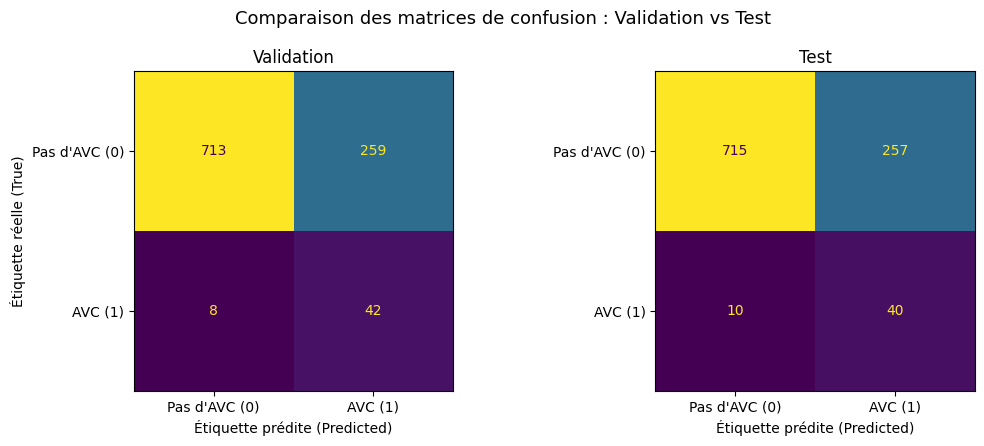

# 🧠 Prédiction du risque d'AVC — Pipeline de Machine Learning

Projet réalisé dans le cadre de la mission **Numeris Conseil** (Brief 12) : construire, entraîner et évaluer un modèle de Machine Learning capable d'identifier précocement les patients à risque élevé d'accident vasculaire cérébral (AVC), à partir de données cliniques et démographiques anonymisées.

---

## 📋 Contexte

Numeris Conseil a transmis un nouveau dataset client (~5 100 patients, données de santé anonymisées) avec pour consigne de livrer :
- un modèle fiable, entraîné et évalué de façon rigoureuse,
- une explication claire, présentable à un public non technique.

## 🎯 Problématique métier

> À partir des données cliniques et démographiques des patients, comment identifier et prédire de manière précoce les nouveaux patients présentant un risque élevé d'accident vasculaire cérébral (AVC / stroke), afin d'optimiser le tri, la prévention et la prise en charge médicale ?

## 📊 Dataset

- **Source** : [Stroke Prediction Dataset (Kaggle)](https://www.kaggle.com/datasets/fedesoriano/stroke-prediction-dataset)
- **Taille** : ~5 100 patients, 10 features (âge, genre, hypertension, maladie cardiaque, statut marital, type de travail, type de résidence, glycémie moyenne, IMC, statut tabagique)
- **Cible** : `stroke` (0 = pas d'AVC, 1 = AVC) — **fortement déséquilibrée** (~4 861 vs ~249, soit moins de 5% de cas positifs)

## ⚙️ Méthodologie

1. **Cadrage** : exploration du dataset, définition de X/y, analyse du déséquilibre de la cible
2. **Split** : `train_test_split` en 3 parties (train 60% / validation 20% / test 20%), stratifié (`stratify=y`), **avant** tout preprocessing pour éviter la fuite de données (data leakage)
3. **Preprocessing** : `ColumnTransformer` avec
   - variables numériques → `SimpleImputer(median)` + `StandardScaler`
   - variables catégorielles → `SimpleImputer(most_frequent)` + `OneHotEncoder`
4. **Modélisation** : `Pipeline` unique (preprocessing + modèle), optimisée via `GridSearchCV` sur 3 modèles candidats :
   - Régression Logistique (baseline, interprétable)
   - Arbre de Décision
   - Forêt Aléatoire (Random Forest)
   
   → 28 combinaisons d'hyperparamètres × 5 plis = 140 entraînements
5. **Métrique** : le **Recall** a été privilégié plutôt que l'accuracy brute, en raison du fort déséquilibre des classes (un modèle naïf prédisant toujours "sain" obtiendrait 95% d'accuracy avec 0% de Recall — inacceptable en contexte médical)
6. **Évaluation** : validation puis test, **le jeu de test n'étant évalué qu'une seule fois**
7. **Sauvegarde** : pipeline complète exportée avec `joblib`

## 🏆 Résultats

**Modèle retenu** : Régression Logistique (`C=0.01`, `class_weight="balanced"`)

| Métrique | Validation | Test |
|---|---|---|
| Recall (AVC) | 0.84 | 0.80 |
| Precision (AVC) | 0.14 | 0.13 |
| F1-score (AVC) | 0.24 | 0.23 |
| ROC-AUC | 0.845 | 0.841 |
| Accuracy | 0.74 | 0.74 |

Les scores de validation et de test sont **cohérents** (écarts inférieurs à 5 points sur toutes les métriques), ce qui indique une bonne capacité de généralisation du modèle.



## ⚠️ Limites à communiquer avant mise en production

- **Precision faible (~13-14%)** : sur les patients identifiés « à risque », plus de 85% ne feront en réalité pas d'AVC. Le modèle est un outil de **pré-tri**, pas un outil de diagnostic autonome — il nécessite une validation clinique systématique.
- **Faible nombre de cas positifs** (249 patients AVC) : rend les estimations de performance sensibles à la variabilité d'échantillonnage. Une réévaluation régulière sur de nouvelles données réelles est recommandée avant toute généralisation.

## 📁 Structure du dépôt

```
.
├── Numeris_Conseil_Stroke_Prediction.ipynb   # Notebook complet (Colab)
├── modele_final.joblib                        # Pipeline entraînée (preprocessing + modèle)
├── Synthèse_écrite.md                          # Synthèse non technique (~1 page)
├── healthcare-dataset-stroke-data.csv          # Dataset source
├── requirements.txt                            # Dépendances Python
├── images/
│   ├── distribution_classes.png
│   └── matrice_confusion_val_test.png
└── README.md
```

## 🛠️ Stack technique

- Python, pandas, numpy, matplotlib
- scikit-learn (`Pipeline`, `ColumnTransformer`, `GridSearchCV`)
- joblib
- kagglehub


## 📝 Auteur
[Xiao](https://github.com/XiaoqingGdc)
