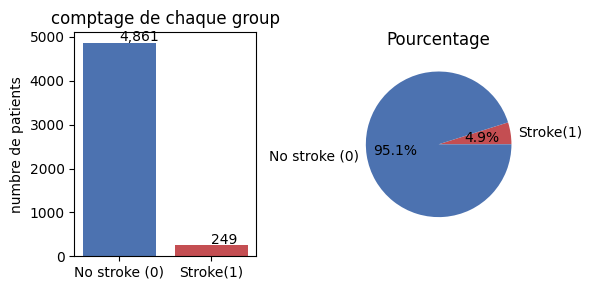

## Problématique métier

Numeris Conseil m'a donné les données médicales de 5 110 patients. Le but est simple : repérer les patients à risque élevé d'AVC. Cela aide les équipes médicales à prioriser leur attention.

## Question 1 : La cible est-elle équilibrée ?

Non. Sur 5 110 patients, 4 861 n'ont pas fait d'AVC. Seulement 249 ont fait un AVC. C'est très déséquilibré. Conséquence : on ne peut pas utiliser l'accuracy (taux de bonne réponse) comme seule mesure. Elle donnerait une fausse impression de succès.

## Question 2 : Pourquoi séparer les données avant tout traitement ?

Il faut d'abord séparer les données (train / validation / test). Ensuite seulement, on peut les transformer.

Pourquoi ? Si on transforme toutes les données avant de les séparer, le modèle "voit" des informations qu'il ne devrait pas voir. On appelle ça une fuite de données. Résultat : le modèle semble meilleur qu'il ne l'est en réalité.

## Question 3 : Pourquoi ces modèles et cette mesure de performance ?

J'ai testé 3 modèles :

- **Régression Logistique** : simple et facile à expliquer. Sert de référence.
- **Arbre de Décision** : capture des liens plus complexes entre les données.
- **Forêt Aléatoire** : combine plusieurs arbres. Plus robuste, évite les erreurs d'un seul arbre.

Pourquoi pas l'accuracy brute ? Parce que les cas malades sont rares (moins de 5%). Un modèle qui dirait toujours "en bonne santé" aurait 95% d'accuracy, mais ne trouverait aucun vrai malade. C'est inacceptable en médecine.

C'est pourquoi j'utilise le Recall. Cette mesure vérifie combien de vrais malades le modèle trouve. Elle limite le risque de rater un cas grave.

## Question 4 : Val et test sont-ils cohérents ?

Oui. Les résultats sont proches entre validation et test :

- Recall : 0.84 en validation, 0.80 en test
- ROC-AUC : 0.845 en validation, 0.841 en test

L'écart est petit. Le modèle fonctionne donc bien sur des données qu'il n'a jamais vues.

Si l'écart avait été grand, je n'aurais pas dû modifier les réglages à partir du score de test. Cela fausserait l'évaluation. J'aurais dû chercher la cause du côté de l'entraînement, puis noter honnêtement ce problème comme une limite du modèle.

## Question 5 : Synthèse

### Synthèse — Modèle de prédiction du risque d'AVC

### Le problème

Les données contiennent les informations médicales de 5 110 patients. Seuls 249 ont fait un AVC (moins de 5%). Ce petit nombre de cas a guidé tous mes choix.

### Le modèle retenu

J'ai testé 3 modèles avec 140 réglages différents au total. Le modèle le plus simple — la **régression logistique** — donne les meilleurs résultats. C'est une bonne nouvelle : il est aussi le plus facile à expliquer à une équipe médicale.

### La performance

Sur des patients jamais vus par le modèle, il trouve 8 vrais malades sur 10. C'est le résultat le plus important pour un outil de dépistage : mieux vaut trop alerter que rater un cas.

En échange, beaucoup de patients signalés "à risque" ne feront pas d'AVC. C'est un choix volontaire : mieux vaut trop alerter que manquer un vrai cas.

J'ai vérifié ce résultat deux fois, sur deux groupes différents de patients. Les résultats sont proches. Le modèle est donc stable et fiable.

### Les limites

- **Beaucoup de fausses alertes** : le modèle seul ne peut pas poser un diagnostic. Un médecin doit toujours vérifier.
- **Peu de vrais cas dans les données** (249 patients) : le résultat pourrait varier avec plus de données. Il faut confirmer la performance sur plus de patients réels.

### Recommandation

Ce modèle peut aider à prioriser les patients à examiner. Il ne doit jamais remplacer le jugement d'un médecin.

Avant de l'utiliser à grande échelle, il faut :
1. Tester le modèle sur plus de patients réels ;
2. Réentraîner le modèle régulièrement avec de nouvelles données ;
3. Toujours faire vérifier les alertes par une personne.